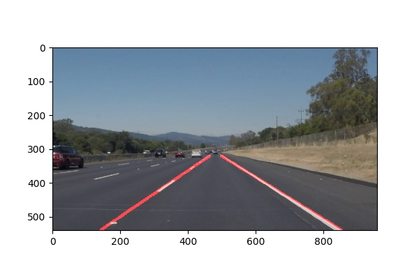

#**Finding Lane Lines on the Road** 

File Description
---
[Project Pipeline Description](https://github.com/dhruvbalhara/CarND-LaneLines-P1/blob/master/p1_description.md)

Jupiter Notebook with the [project code / solution](https://github.com/dhruvbalhara/CarND-LaneLines-P1/blob/master/p1_solution.ipynb)

Output of [test images](https://github.com/dhruvbalhara/CarND-LaneLines-P1/tree/master/test_images) is placed in [test_images_output](https://github.com/dhruvbalhara/CarND-LaneLines-P1/tree/master/test_images_output) folder

Output of 2 example videos [solidWhiteRight.mp4](https://github.com/dhruvbalhara/CarND-LaneLines-P1/blob/master/solidWhiteRight.mp4) and [solidYellowLeft.mp4](https://github.com/dhruvbalhara/CarND-LaneLines-P1/blob/master/solidYellowLeft.mp4) is in [output](https://github.com/dhruvbalhara/CarND-LaneLines-P1/tree/master/output) folder

